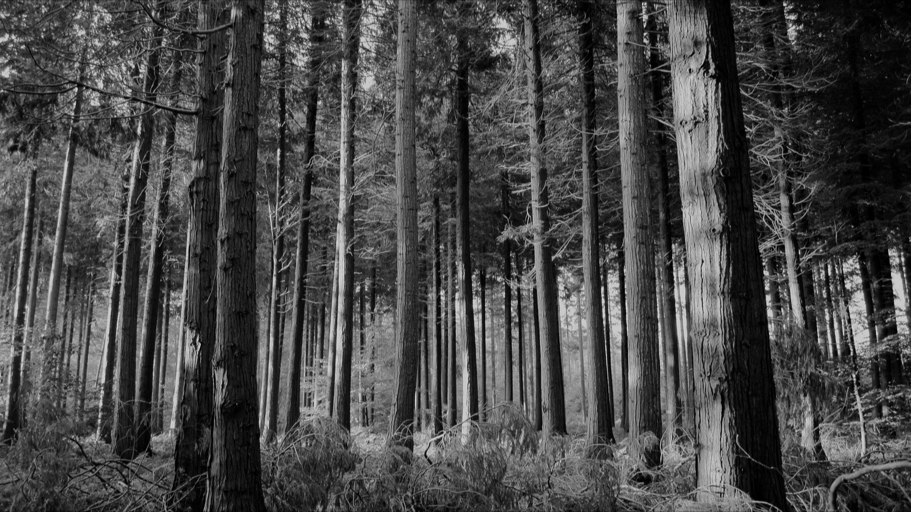

# Фильтр Гаусса
#### Запуск
Перед запуском с помощью менеджера пакетов pip нужно установить пакет OpenCV.

`pip install opencv-python`

Для запуска программы нужно передать в качестве аргумента командной строки относительный или абсолютный путь до изображения.
#### Реализация

В данной реализации использовались вычисления только в целых числах. Для этого было принято решение предпосчитать ядро в целых числах с вынесением общего множителя, сохраняя отношение между элементами.

Благодаря свойству сепарабельности (сохранение отношения между элементами строки\столбца), фильтр Гаусса с ядром 5x5 можно свести до двух проходов 1D фильтров 5x1 и 1x5 (порядок не важен).

Normalizer было принято использовать для сохранения яркости изображения, поскольку, при делении суммы на общий множитель(от перевода float в uint8), яркость уменьшается.
Normalizer - массив преффиксных сумм от ядра свертки, с помощью него не происходят дополнительные вычисления внутри прохода по изображению, что уменьшает число операций на свертку.

#### Оценка трудовемкости алгоритма 
Будем оценивать грубо трудоемкость и память для одного прохода алгоритма с фиксированной сигмой.
Один проход алгоритма состоит из трех частей:
  1) Выбор ядра свертки, вычисление массива префиксных сумм normalizer, получение ширины и высоты изображения
  2 + 6 + 2 = 10
  На данном этапе 2 операции под выбор свертки, 1+5=6 операций на выделение памяти под list и получение префиксных сумм, а так же 2 операции на выделение памяти под ширину и высоту и присваивание.
  2) Горизонтальный проход
  В данном блоке происходит выделение памяти под буфферный двумерный ndarray для результата горизонтальной свертки.
  1080 * 1920 * (6 + 1 + 10 + 2) = 39398400
  Внутри второго фора:
  - 4 операции на min/max, и 2 на присваивание.
  - 1 операция на выделение памяти под new_pix
  - 10 на проход(5 блоков из умножения и суммы на каждый пиксель)
  - 2 операции на деление и присваивание
  3) Вертикальный проход
  В данном блоке происходит выделение памяти под буфферный двумерный ndarray для результата вертикальной свертки.
  1080 * (6 + 1920 * (1 + 10 + 2)) = 26963280
  Внутри первого фора тратится 4 операции на min/max, и 2 на присваивание.
  Внутри второго фора:
  - 1 операция на выделение памяти под new_pix
  - 10 на проход(5 блоков из умножения и суммы на каждый пиксель)
  - 2 операции на деление и присваивание
  
Памяти тратится:
  - 5 байт под ядро
  - 3 * 1920 * 1080 = 6220800 байт = 6075 КБайт под изображение, буфер и конечное изображение
 

Приближенно получаем 7*10^7 операций и 6075 КБайт.
